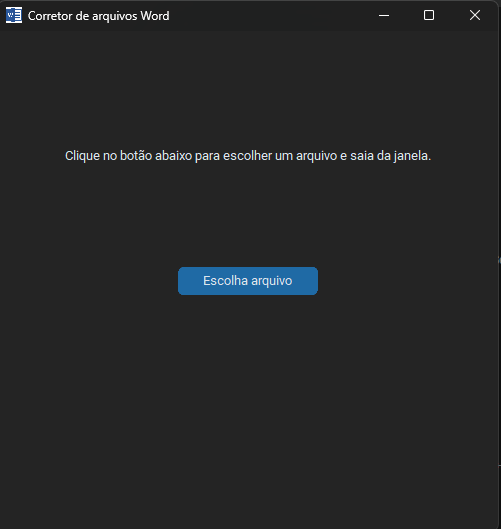

# 🧾 Scriptura

> Tool that improves and corrects `.docx` files using AI.

---

## 📖 About

Scriptura is a project made with Python that helps users improve Word documents automatically.

The application provides a graphical interface where users can select a `.docx` file and let the automataion open Claude AI to analyze and enhance the text.

---

## ✨ Features

* 📄 Open `.docx` files
* 🤖 AI-powered text correction
* 🖥️ Simple graphical interface
* ⚡ Fast automation workflow
* 🪄 Automatic document enhancement

---

## 🛠️ Technologies Used

* `Python`
* `CustomTkinter`
* `Tkinter`
* `PyAutoGui`

---

## 📦 Usage

Download one of the `.exe` files
 
Run it

Then:

1. Select a `.docx` file
2. Wait for the automation
3. Receive the corrected version

---

---

## 🧠 Future Ideas

* Multiple language support
* Dark mode improvements
* Other ideas
---

## 📸 Preview

---

## 📜 License

This project is licensed under the MIT License.

---

## 👨‍💻 Author

Made by Pedro 🚀
